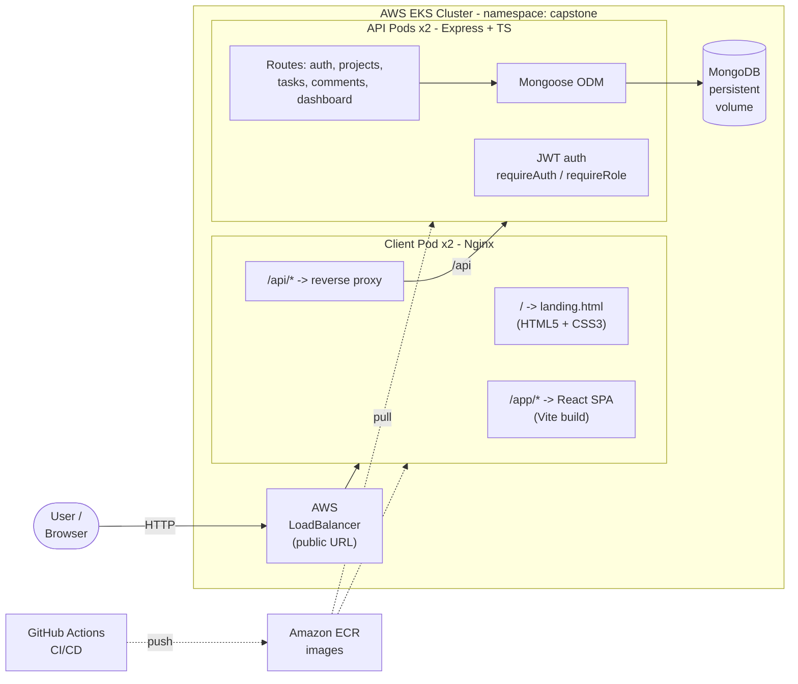
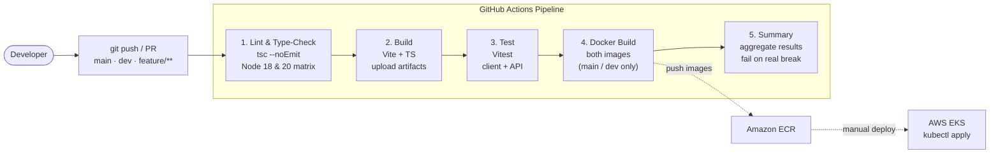

# Capstone Presentation Guide — Project Task Tracker

**Team:** Donavan Francis · Asma Sadia
**App:** Project Task Tracker — collaborative project & task management
**Total time:** 10 minutes (Architecture 3 · Lessons 2 · Live Demo 5)
**Order:** Architecture Walkthrough → Lessons Learned → Live Demo

---

## 0. Pre-Flight Checklist (do this 10 min before presenting)

```bash
# 1. Confirm cluster is reachable
kubectl get nodes

# 2. Confirm all pods are Running (namespace: capstone)
kubectl get pods -n capstone

# 3. Grab the public URL (AWS ELB hostname) — THIS is your demo URL
kubectl get svc capstone-client -n capstone \
  -o jsonpath='{.status.loadBalancer.ingress[0].hostname}'; echo

# 4. Smoke-test the API through the load balancer
URL=$(kubectl get svc capstone-client -n capstone -o jsonpath='{.status.loadBalancer.ingress[0].hostname}')
curl -s "http://$URL/api/health"; echo
```

- [ ] `http://<ELB-URL>/` → landing page loads
- [ ] `http://<ELB-URL>/app/` → React app loads
- [ ] Demo login account works (or register a fresh one live)
- [ ] Seed data present so the dashboard isn't empty (`npm run seed` in `api/` against prod DB if needed)
- [ ] Zoom to ~125% browser zoom so the room can read it

---

## 0b. Deploy-From-Scratch Runbook (reference only — already deployed)

> Current state: the EKS cluster **`capstone`** is **live** (region `us-east-1`, 2× t3.medium)
> and the app is deployed. Public URL:
> **http://a6edf61779f0b405abccc4bb450b5dd3-1760106026.us-east-1.elb.amazonaws.com/**
> AWS account: **891612576490** · ECR repos: `capstone-client`, `capstone-api`.
> The steps below are only needed to rebuild the environment from scratch.

```bash
ACCOUNT_ID=891612576490
REGION=us-east-1
ECR=$ACCOUNT_ID.dkr.ecr.$REGION.amazonaws.com

# 1. Wait for the cluster, then point kubectl at it
watch -n 30 "eksctl get cluster --region $REGION"   # Ctrl-C once ACTIVE
aws eks update-kubeconfig --name capstone --region $REGION
kubectl get nodes                                    # should list 2 Ready nodes

# 2. Log Docker into ECR
aws ecr get-login-password --region $REGION | \
  docker login --username AWS --password-stdin $ECR

# 3. Build + push both images (run from repo root)
docker build -t $ECR/capstone-api:latest    -f api/Dockerfile .
docker build -t $ECR/capstone-client:latest -f client/Dockerfile .
docker push $ECR/capstone-api:latest
docker push $ECR/capstone-client:latest

# 4. Inject the real account ID into the manifests (they ship with ACCOUNT_ID placeholder)
sed -i "s/ACCOUNT_ID/$ACCOUNT_ID/g" k8s/api.yaml k8s/client.yaml

# 5. Apply manifests IN ORDER
kubectl apply -f k8s/namespace.yaml
kubectl apply -f k8s/secrets.yaml
kubectl apply -f k8s/mongo.yaml
kubectl apply -f k8s/api.yaml
kubectl apply -f k8s/client.yaml

# 6. Wait for rollout, then grab the public URL
kubectl rollout status deploy/capstone-api    -n capstone
kubectl rollout status deploy/capstone-client -n capstone
kubectl get svc capstone-client -n capstone \
  -o jsonpath='{.status.loadBalancer.ingress[0].hostname}'; echo
```

> The ELB hostname takes a few minutes to resolve in DNS after it appears. Test with
> `curl -s http://<ELB-URL>/api/health` until it returns JSON.

---

## 1. Architecture Walkthrough — 3 minutes (word-for-word script)

> This is our **opening section**. Keep the architecture diagram on screen for the whole block.
> Text in **quotes** is what you *say*; text in _(parentheses)_ is what you *do*. Times are cumulative targets for this 3-minute block.

_(Open with a brief greeting before Beat 1.)_

> "Hi everyone — we're Donavan and Asma, and this is **Project Task Tracker**, a collaborative project-and-task management app. It's fully containerized and running live on **AWS EKS**. We'll walk you through the architecture, share what we learned, and then show it to you live at the end."

### Architecture Diagram (put this on a slide)



> A pre-rendered image is at `presentation-assets/architecture.png` if your slide tool can't render Mermaid.

### Beat 1 — System architecture: what runs where · target 0:00–0:45

_(Trace the diagram with your cursor as you talk.)_

> "Here's how the whole thing fits together. There's **one public entry point** — the AWS load balancer on the left — and it sends traffic to our **Nginx client pods**, which run as **two replicas**. Nginx is the traffic cop: the root path serves our **static landing page**, slash-app serves the **React single-page app**, and slash-api is a **reverse proxy** to the backend."

> _(Follow the `/api` arrow to the API pods, then down to Mongo.)_ "API calls get proxied to our **Express API — also two stateless replicas**. Every request passes through **JWT auth middleware**, hits the right **route**, and reads or writes through **Mongoose** into **MongoDB**, which has a **persistent volume** so data survives restarts. Because the API is stateless, Kubernetes can scale or restart it freely and the load balancer just spreads requests across the replicas."

### Beat 2 — Docker + Kubernetes · target 0:45–1:45

> "Every piece is **containerized with Docker**, and we use **multi-stage builds** to keep images small. The client build compiles the React app with Vite in one stage, then copies just the static output into a slim Nginx image. The API compiles TypeScript to JavaScript on an Alpine Node base — around 180 megabytes."

> "For **local development**, a single `docker-compose up` spins up all three services — web, API, and Mongo — on one network, so our dev environment mirrors production."

> "For **production**, we run on **Amazon EKS** — managed Kubernetes. Our `k8s` folder has manifests for the namespace, secrets, MongoDB, the API, and the client. The images live in **Amazon ECR**. Each deployment uses **rolling updates** for zero-downtime releases, sets **CPU and memory requests and limits**, and has **liveness and readiness probes** so Kubernetes only sends traffic to healthy pods and restarts anything that hangs. The client service is **type LoadBalancer** — and that's the public URL we'll open in the live demo."

### Beat 3 — CI/CD pipeline · target 1:45–2:30

#### CI/CD Diagram (put this on a slide)



> A pre-rendered image is at `presentation-assets/cicd.png` if needed.

> "On the automation side, we have a **GitHub Actions pipeline** that runs on every push and pull request to main, dev, and feature branches. It has five stages:"

> _(Trace the boxes left to right as you name them.)_ "First, **lint and type-check** — a strict TypeScript compile on both the client and API, run across a **Node 18 and 20 matrix**. Second, **build** — it builds both apps and uploads the artifacts. Third, **test** — our Vitest suite, React Testing Library on the frontend plus API tests. Fourth, **Docker build** — it builds both container images, gated to just the main and dev branches. And fifth, a **summary** stage that aggregates every job's result and fails the pipeline if anything real broke."

> _(Point to the dotted arrows out to ECR and EKS.)_ "The Docker images get pushed to **Amazon ECR**, and the final deploy to **EKS** is the one manual step we'd automate next. Bottom line: nothing reaches a demo without passing types, build, and tests first."

### Beat 4 — One interesting code pattern · target 2:30–3:00

> Pick **ONE** of the following and say it with confidence. Default recommendation: **A (parallel dashboard aggregation)** — it sets up the dashboard the audience will see in the demo. Have the file open on a second slide if possible.

**A. Parallel dashboard aggregation** — `api/src/routes/dashboard.ts`
> "Our dashboard endpoint is a nice example. A naive version would run each query one after another — count users, then count projects, then count tasks, and so on — nine sequential database trips. Instead, we fire **all nine at once** inside a single `Promise.all`, so they run **in parallel** and the whole thing resolves in about the time of the slowest one. A small helper called `toCountMap` then turns Mongo's raw group-by output into the clean status-to-count shape the UI wants. It's a simple pattern, but it's the difference between a snappy dashboard and a sluggish one."

**B. Axios interceptors** — `client/src/api/client.ts`
> "We handle auth in exactly one place. A **request interceptor** automatically attaches the JWT to every outgoing call, and a **response interceptor** watches for a 401 — if the token's expired, it clears storage and redirects to login globally. No individual component has to think about auth."

**C. The Nginx routing bug we solved** — `client/nginx.conf`
> "Our trickiest bug: the React app's JavaScript and CSS under slash-app-slash-assets were **404-ing**. The cause was Nginx **location precedence** — a regex block for caching static assets was winning over our slash-app rule, so those files had no document root. The fix was making slash-app a **caret-tilde prefix match**, which beats the regex. Small change, and we documented the reasoning right in the config so the next person doesn't fall into it."

**D. Type-safe auth middleware** — `api/src/middleware/auth.ts`
> "We extended Express's own Request type so that after our auth middleware runs, `req.user` is **fully typed** everywhere downstream — no `any`, no casting. And our `requireRole` guard composes cleanly on top of it — that's what powers the role-based 403 you'll see in the demo."

---

## 2. Lessons Learned — 2 minutes (word-for-word script)

> Deliver this as a team — **split the three questions between the two of you** so both voices are heard. Pick the version that's true for you; the quoted lines below are a starting script. Be honest and specific — graders can smell generic answers.

### Beat 5 — What went well as a team? · target 0:00–0:40 · _(Speaker: ____)_

> "A few things worked really well for us as a team. First, we split ownership across the **full stack** — API, database, and frontend — but reviewed each other's work through **pull requests** on a feature-to-dev-to-main branch flow, so no one was siloed and nothing merged unseen."

> "Second, we agreed on the **API contract early** — the endpoints and the shape of the data — which meant the frontend and backend could be built **in parallel** without blocking each other. And third, our **CI pipeline** caught type and build errors automatically, so we never showed up to a working session with a broken main branch."

### Beat 6 — Hardest technical challenge? · target 0:40–1:30 · _(Speaker: ____)_

> Pick the ONE that's genuinely true for your team. Default: the Nginx routing bug — it's concrete and you can point to the fix.

> "The hardest technical challenge was getting the **routing right in Nginx**. We were serving three different things through one host — a static landing page at the root, the React single-page app at slash-app, and a proxy to the API. The React assets kept **404-ing** because of Nginx's location-precedence rules — a regex caching block was silently overriding our app route. It took real digging to understand *why*, and the fix was a one-line change to a caret-tilde prefix match. It taught us a lot about how Nginx actually resolves locations."

> Alternative challenges you can substitute:
> - "Getting the **EKS load balancer and ECR image pulls** working end-to-end — matching image tags, the pull policy, and waiting for AWS to provision the external hostname."
> - "Wiring the **JWT auth flow** across both sides — the Axios interceptors on the client and the auth middleware on the server, including handling expired tokens cleanly."

### Beat 7 — What would you do differently? · target 1:30–2:00 · _(Speaker: ____)_

> "If we did it again, there are a few things we'd change. We'd put an **Ingress with HTTPS and a real domain** in front, instead of a raw load-balancer URL. We'd move configuration into **ConfigMaps** and manage secrets with a proper secret store rather than committing them. We'd add more **integration test coverage** and automate the last mile — **pushing to ECR and deploying** straight from the pipeline, since right now that final deploy step is still manual. And we'd run **MongoDB as a managed service or a replica set** for real durability, instead of a single in-cluster instance."

> _(Transition into the demo.)_ "That's the design and what we learned — now let's make it concrete and **show you the app running live**."

---

## 3. Live Demo — 5 minutes (word-for-word script)

**Roles:** one person is the **Driver** (shares screen, clicks, types). The other is the **Narrator** (talks through everything below). Practice the hand-off once.

**Demo accounts (from the seed script — memorize these):**
| Role | Email | Password |
|---|---|---|
| Admin | `admin@example.com` | `password123` |
| Manager | `manager@example.com` | `password123` |
| Contributor | `contributor@example.com` | `password123` |

> Notes below: text in **quotes** is what you *say*. Text in _(parentheses)_ is what you *do*. Times are cumulative targets for this 5-minute block.

### Beat 8 — Landing page · target 0:00–0:45 · `http://<ELB-URL>/`

_(Start with the landing page already open in the browser at the public ELB URL.)_

> "This is the live app on **AWS EKS** — the address bar is the public load-balancer URL, not localhost. This front door is our landing page, and it's **hand-written HTML5 and CSS3 — zero JavaScript**. Semantic layout with nav, header, main, sections and a footer; the feature cards use **CSS Grid**, the colors come from **CSS custom properties**, and the buttons have smooth hover transitions."

_(Slowly drag the browser window narrower — or open dev-tools device toolbar — so it visibly reflows to one column.)_

> "It's fully responsive — there's a mobile breakpoint at 640 pixels, so it collapses cleanly to a single column on phones."

_(Click the **"Launch the App →"** button.)_

> "Let's launch the actual app — that link takes us from the static page to the React SPA at slash-app."

**If it lags:** "Nginx is serving the static page and routing us over to the React bundle now…"

### Beat 9 — Login / Auth · target 0:45–1:35 · `http://<ELB-URL>/app/login`

_(You should now be on the React app. If it lands on the dashboard already authenticated, click **Logout** first so you can show the login.)_

> "Now we're in the **React single-page app**. It's protected — every app route sits behind an auth guard, so an unauthenticated visitor gets bounced to this login screen."

_(Type into the Email field: `manager@example.com`, Password: `password123`.)_

> "I'll log in as a **manager**. On the backend, passwords are hashed with **bcrypt** — we never store plaintext — and a successful login returns a **JWT** that we keep client-side."

_(Click **Login**. You land on the Dashboard. Point at the top-right of the navbar showing the name + role badge.)_

> "We're in. Notice the navbar shows my name and my **role** — manager. From here on, every API request automatically carries that token: we attach it once in an **Axios request interceptor**, so no individual call has to remember to authenticate."

**Optional (only if time is comfortable):** _(open browser DevTools → Application → Local Storage)_ "You can see the JWT stored right here."

### Beat 10 — Dashboard with real data · target 1:35–2:40 · `/app`

_(You're on the Dashboard. Gesture across the four stat cards at the top.)_

> "This dashboard is **100% live data from MongoDB** — nothing is hard-coded. Up top we have totals: users, projects, tasks, and comments."

_(Point to the three breakdown cards.)_

> "Below that, tasks broken down **by status** — todo, in-progress, review, done — tasks **by priority**, and projects **by status**. And at the bottom, the most recent tasks and projects with who owns them."

_(Pause, then deliver the key line — this pays off the architecture pattern you described earlier.)_

> "And remember that code pattern we mentioned — **all of this comes from a single API call** to `/api/dashboard`, firing **nine queries in parallel** with `Promise.all`. One fast round-trip. Watch these numbers change as we add data."

_(Remember the current **Projects** and **Tasks** counts out loud so the change is obvious later.)_

> "Right now we've got _(read number)_ projects and _(read number)_ tasks — keep an eye on those."

### Beat 11 — Create resources (the write path) · target 2:40–4:00

_(Click **Projects** in the navbar.)_

> "Let's create something. Here are the existing projects — each card shows its status and owner."

_(Click **+ New Project**. An inline form slides open.)_

> "I'll add a new one."

_(Type Name: `Capstone Demo`, Description: `Live demo project`. Click **Create Project**.)_

> "Submit — and it appears instantly. That just did a **POST to `/api/projects`**, authenticated with my token, wrote through **Mongoose** to **MongoDB**, and the list re-fetched."

_(Click the new **Capstone Demo** card to open its detail page.)_

> "Opening it, we see the project details — owner, members — and a **tasks table** for this project. It's empty, so let's give it a task."

_(Click **Tasks** in the navbar. Click **+ New Task**.)_

> "On the Tasks page I'll create a task, pick the project from this dropdown, and set its **priority** and **status**."

_(Fill Title: `Prepare demo script`, select Project: `Capstone Demo`, Priority: `high`, Status: `in-progress`. Click **Create Task**.)_

> "Create — and there it is in the table with its status and priority badges."

_(Show the status filter dropdown.)_

> "This list also filters client-side by status…"

_(Select **In Progress** in the filter, then back to **All Statuses**.)_

> "…so I can instantly narrow to just in-progress work."

_(Click **Dashboard** in the navbar.)_

> "And back on the dashboard — the **project and task counts have gone up**, and our new in-progress task shows in the status breakdown and recent activity. That's the **full end-to-end write path**: React → Nginx proxy → Express → Mongoose → MongoDB, and straight back into the aggregated view."

> _Note:_ comments are part of the data model and show in the totals from our seed data — the collaboration layer — but we create those via the API rather than a form in this build.

### Beat 12 — Advanced feature: Role-Based Access Control · target 4:00–5:00

> "Last thing — **role-based access control**, enforced on the server, not just hidden in the UI. This is the `requireRole` guard from the architecture section in action."

_(Click **Logout** in the navbar. Log back in as the contributor — Email: `contributor@example.com`, Password: `password123`, click **Login**.)_

> "I'm now logged in as a **contributor** — you can see the role badge changed in the navbar. Contributors can view everything and add tasks, but they are **not allowed to create projects** — that's reserved for managers and admins."

_(Go to **Projects** → click **+ New Project** → fill Name: `Should Fail`, click **Create Project**.)_

> "Watch — I'll try to create a project anyway…"

_(The request returns 403 and the red error message appears.)_

> "…and the server **rejects it**. That block comes from our `requireRole('admin','manager')` middleware — even if someone bypassed the UI and hit the API directly, they'd get a **403 Forbidden**. Authorization lives in the backend where it can't be tampered with."

> _(Closing line for the whole presentation.)_ "And that's Project Task Tracker: a static landing page, an authenticated React SPA, a live aggregated dashboard, full CRUD, and enforced roles — all containerized and running on **AWS EKS**. Thanks so much — we're happy to take any questions."

**Backup plan if the network dies mid-demo:** keep narrating the intended action ("this would POST to `/api/projects`…") and switch to the screen recording only if you're stuck for more than ~10 seconds. Never stare at a spinner in silence.

---

## Timing Cheat-Sheet
| Segment | Beats | Target | Owner |
|---|---|---|---|
| Architecture: where / Docker+K8s / CI / pattern | 1–4 | 0:00–3:00 | ____ |
| Lessons learned (well / hardest / differently) | 5–7 | 0:00–2:00 | ____ |
| Demo: landing → login → dashboard | 8–10 | 0:00–2:40 | ____ |
| Demo: create project + task, filter, RBAC 403 | 11–12 | 2:40–5:00 | ____ |

## If Something Breaks
- Landing/app won't load → `kubectl get pods -n capstone`, then `kubectl logs deploy/capstone-client -n capstone`.
- API errors → `kubectl logs deploy/capstone-api -n capstone`.
- No external URL → the ELB is still provisioning; use the backup recording and show `kubectl get svc` live.
- Empty dashboard → run the seed script against the prod DB before presenting.
