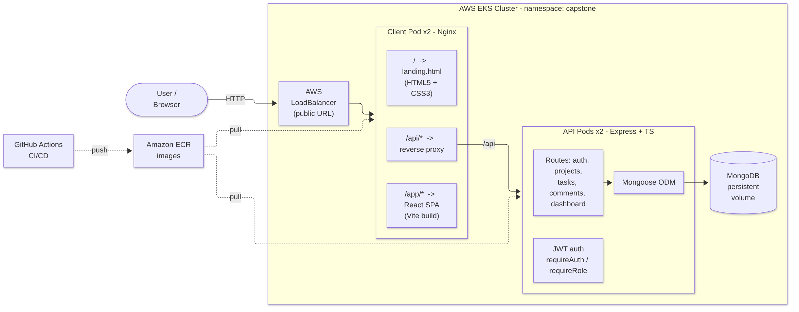
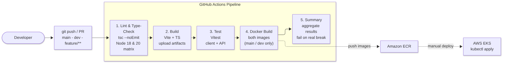

# Project Task Tracker

A collaborative project & task management app

**Donavan Francis · Asma Sadia**

Running live on AWS EKS

---

## What It Is

- Register & log in with JWT authentication
- Create projects and tasks (status + priority)
- Comment and collaborate on work
- Live dashboard with aggregate statistics
- Role-based access (admin, manager, contributor)

---

## Tech Stack

- **Frontend:** React 18, TypeScript, Vite, React Router, Axios
- **Landing page:** hand-written HTML5 + CSS3, zero JavaScript, responsive
- **Backend:** Express + TypeScript, Mongoose, JWT, bcrypt
- **Database:** MongoDB 7
- **Testing:** Vitest + React Testing Library
- **DevOps:** Docker, Kubernetes (AWS EKS), Amazon ECR, Nginx, GitHub Actions

---

## System Architecture

- One public AWS LoadBalancer → Nginx client pods (x2)
- Nginx serves landing page, React SPA, and proxies `/api`
- Express API (x2, stateless, JWT) → Mongoose → MongoDB (persistent volume)

---

## Docker + Kubernetes

- Multi-stage Docker builds keep images small (API ~180 MB on Alpine)
- Docker Compose runs web + API + Mongo locally for dev parity
- EKS: rolling updates, CPU/memory limits, liveness & readiness probes
- Client Service is `type: LoadBalancer` → the public demo URL

---

## CI/CD Pipeline

1. Lint & Type-Check (Node 18 & 20) → 2. Build → 3. Test → 4. Docker Build → 5. Summary
- Images push to Amazon ECR; deploy to EKS
- Nothing reaches a demo without passing types, build, and tests

---

## Interesting Code Pattern

**Parallel dashboard aggregation**

- Naive version: 9 sequential DB queries
- Ours: all 9 fired at once with `Promise.all` → one fast round-trip
- A small helper maps Mongo's group-by output to the shape the UI needs

---

## Lessons Learned

**What went well**
- Full-stack ownership with PR reviews; contract-first API enabled parallel work; CI caught errors early

**Hardest challenge**
- Nginx location-precedence bug — React assets under `/app/assets` 404'd; fixed with a `^~ /app` prefix match

**What we'd do differently**
- Ingress + HTTPS/domain; ConfigMaps + secret store; automated ECR push & EKS deploy; managed MongoDB

---

# Thank You

Project Task Tracker — full-stack, containerized, cloud-deployed on AWS EKS

**Questions?**
